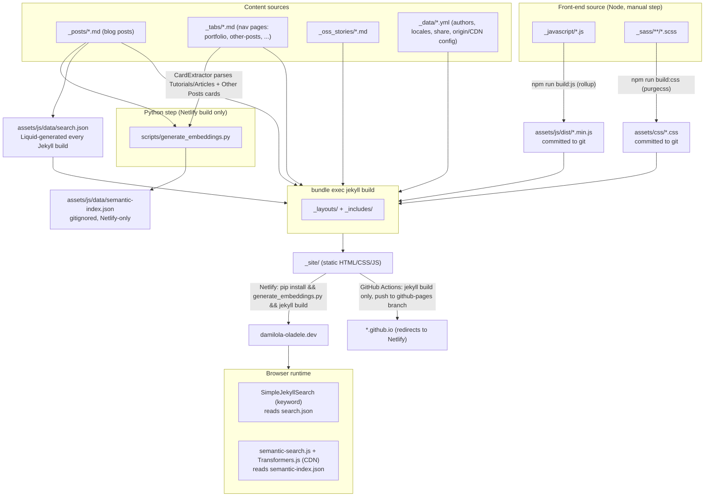

# CLAUDE.md

This file provides guidance to Claude Code (claude.ai/code) when working with code in this repository.

## What this is

Damilola Oladele's personal blog (`damilola-oladele.dev`) — a Jekyll site built on the [Chirpy theme](https://github.com/cotes2020/jekyll-theme-chirpy). The bulk of the repository is upstream Chirpy theme code (Ruby/Jekyll layouts, includes, SCSS, JS build pipeline); the personal content lives in `_posts/`, `_data/`, `_tabs/`, and `_oss_stories/`. One custom feature — opt-in semantic search — has been added on top of the stock theme.

## Writing blog posts

Follow this style guide when drafting or editing anything in `_posts/` — voice, tone, structure, grammar/mechanics, banned words and phrases, and front matter conventions are all defined there:

- @blog-writing-style-reference.md

## Common commands

Ruby/Jekyll (requires Bundler; `.ruby-version` pins the Ruby version):

```bash
bundle install                # install Jekyll + theme gems
bash tools/run.sh              # serve locally with live reload at 127.0.0.1 (wraps `bundle exec jekyll s -l`)
bash tools/run.sh -H 0.0.0.0    # bind to a different host (e.g. inside a container)
bash tools/run.sh -p            # serve in production mode (JEKYLL_ENV=production)
bash tools/test.sh              # production build into _site/, then run html-proofer against it (internal links, etc.)
```

Front-end assets (Node/npm; only needed when touching `_javascript/` or `_sass/`):

```bash
npm install
npm run build       # build:css (purgecss) + build:js (rollup) together
npm run build:js     # rollup bundle for _javascript/*.js -> assets/js/dist/
npm run watch:js     # rollup in watch mode, for use alongside `tools/run.sh`
npm run build:css    # purgecss over compiled CSS
npm run lint:scss    # stylelint over _sass/**/*.scss
npm run lint:fix:scss # same, with --fix
npm test             # currently just runs lint:scss
```

There is no JS test suite and no Ruby test suite beyond the html-proofer link/HTML check in `tools/test.sh`. VS Code tasks (`.vscode/tasks.json`) wrap the same `tools/*.sh` and npm scripts if working from the editor's task runner.

Semantic search index (Python; normally only runs in CI/Netlify, see below):

```bash
pip install -r requirements.txt
python scripts/generate_embeddings.py   # regenerates assets/js/data/semantic-index.json from _posts/
```

## Architecture

### System overview

The site is a static blog built in layers. Content and source files never reach a browser directly — everything passes through a build step first, and two different, asymmetric pipelines turn that source into what actually gets deployed.



**Layers, top to bottom:**

- **Content** — `_posts/` (blog posts), `_tabs/` (nav pages, including the hand-authored Portfolio/Other Posts link cards), `_oss_stories/` (custom collection), `_data/` (site-wide YAML: authors, locale strings, share config, CDN origin config).
- **Front-end source** — `_javascript/` (ES modules, see `_javascript/modules/{components,layouts}/`) and `_sass/` (partials forwarded through `main.scss` → `base`/`components`/`layout`/`pages`). Neither compiles automatically on deploy; see the callout below.
- **Search indices** — two independent, differently-generated JSON files: `search.json` is a Liquid-templated source file that Jekyll regenerates from `site.posts` on every build (both deploy paths); `semantic-index.json` is produced only by the Python script, only on Netlify.
- **Templating** — `_layouts/` (page skeletons: `default`, `post`, `page`, `home`, `archives`, `category`/`categories`, `tag`/`tags`, `oss-story`/`oss-stories-list`, `compress`) and `_includes/` (partials composed into those layouts — `head.html` for meta/SEO/resource hints, `sidebar.html`/`topbar.html` for navigation and search UI, `footer.html`, `search-loader.html`/`search-results.html` for keyword search wiring).
- **Build** — Ruby/Jekyll compiles Markdown + Liquid + Sass into `_site/`. Node (rollup/purgecss) and Python (`generate_embeddings.py`) are separate, independently-triggered build steps that feed committed or generated artifacts into that Jekyll build rather than being part of it.
- **Deploy** — Netlify (primary, custom domain) and GitHub Pages (secondary, immediately redirects to Netlify via a script in `head.html`) — see the next section for how they diverge.
- **Runtime** — the browser runs two independent search implementations side by side (see "Semantic search" below).

**Critical gotcha:** neither deploy path runs `npm run build`. `assets/js/dist/*.min.js`, `assets/css/*.css` (compiled via Jekyll's own Sass processor from `assets/css/jekyll-theme-chirpy.scss`, but *purged* only by the manual `npm run build:css` step), and `_sass/vendors/_bootstrap.scss` are committed straight to git rather than generated during deploy. Editing `_javascript/` or `_sass/` and pushing without first running `npm run build` locally and committing the output will not change the live site — the deploy will succeed, but silently serve the old bundle.

### Two independent deploy paths

- **Netlify (primary/production)** — `netlify.toml` build command is `pip install -r requirements.txt && python scripts/generate_embeddings.py && bundle exec jekyll build`. This is what generates the semantic search index before Jekyll builds. `netlify-original.toml` is kept as a reference of the pre-semantic-search build command (plain `bundle exec jekyll build`).
- **GitHub Pages** — `.github/workflows/jekyll.yml` builds with `bundle exec jekyll build` only (no Python/embedding step) and deploys via `actions/deploy-pages`, triggered on push to a `github-pages` branch. Because this path skips `generate_embeddings.py`, semantic search's index file won't exist in a GitHub Pages build unless generated separately.

When changing the build command or adding a generated asset, both paths need to be considered — they are not symmetric.

### Semantic search (custom addition, not part of upstream Chirpy)

Full design write-up: `docs/semantic-search-implementation.md`. Read it before touching any of this — it documents the reasoning behind the choices below, not just the mechanics.

- Blog is fully static (no backend/DB), so semantic search is opt-in and layered *alongside* the existing SimpleJekyllSearch keyword search rather than replacing it — a toggle in the topbar switches modes, keyword search stays the default.
- Build-time: `scripts/generate_embeddings.py` reads `_posts/*.md`, skips `draft: true` / `published: false`, strips Markdown to plain text, embeds `{title}. {title}. {tags}. {body[:5000]}` with `BAAI/bge-small-en-v1.5` via `sentence-transformers`, and writes `assets/js/data/semantic-index.json` (gitignored — regenerated every build, never commit it).
- The index also includes external links curated in `_tabs/portfolio.md` (Tutorials and Articles) and `_tabs/other-posts.md` (Other Posts), parsed via a stdlib `html.parser.HTMLParser` subclass (`CardExtractor`) in `generate_embeddings.py`. Each card's title + `<p class="card-description">` text (visible in the UI, not hidden metadata) is embedded and tagged with a `tutorials-and-articles`/`other-posts` slug. Cards pointing back to an already-embedded `_posts/` URL are deduped. See "External link embedding" in the design doc before editing card markup or the parser.
- Runtime: `assets/js/semantic-search.js` loads the same `bge-small-en-v1.5` model client-side via Transformers.js (WASM), embeds the user's query, and ranks posts by cosine similarity against the prebuilt index. The model download is only triggered when the user opens the search bar (`#search-trigger` click), not on page load — an idle-preload-on-load approach was tried and reverted because it slowed initial page load on slow connections.
- The model **must** match between build-time (`generate_embeddings.py`) and runtime (`semantic-search.js`) — they produce vectors in the same space only if the same model is used both places.
- `_includes/topbar.html` holds the semantic input/toggle/status line; it deliberately never removes `#search-input` from the DOM (just hides it) because the theme's `_javascript`/`search-display.js` targets that ID directly — see "Compatibility with search-display.js" in the design doc if modifying search markup.
- Styling lives in `_sass/pages/_semantic-search.scss`, forwarded from `_sass/pages/_index.scss`.

### Chirpy theme structure (upstream, not blog-specific)

- `_config.yml` is the single site config (site metadata, comments provider, analytics, PWA, collections). The `defaults:` block sets per-collection front-matter defaults (e.g. all `posts` get `permalink: /posts/:title/` — don't change this without updating every existing post link).
- `_posts/*.md` are the actual blog content — standard Jekyll date-prefixed filenames, front matter drives title/description/date/categories/tags/cover image/`published`.
- `_tabs/*.md` define top-level nav pages (Archives, Categories, Tags, Portfolio, Resume, Other Posts, OSS Doc Stories); `_oss_stories/` is a custom Jekyll collection (see `_plugins/oss_stories_tags.rb` and the `oss_stories` collection config in `_config.yml`) for open-source contribution write-ups, rendered via `_layouts/oss-story.html` / `oss-stories-list.html`.
- `_includes/` and `_layouts/` are the theme's Liquid partials/templates; `_javascript/` (source) builds to `assets/js/dist/` via rollup (`rollup.config.js`), and `_sass/` compiles via Jekyll's own Sass pipeline at deploy time, with a separate purgecss pass (`purgecss.js`) that only runs when `npm run build:css` is invoked manually (see "Critical gotcha" in System overview above — this is not automatic).
- `_data/` holds YAML data used across the site (authors, contact info, locale strings, social share config).
- Front-end code style: `.editorconfig`, `.stylelintrc.json` (SCSS), `eslint.config.js` (JS — currently minimal), `.markdownlint.json` for Markdown; a Husky `commit-msg` hook + commitlint enforce Conventional Commits (`@commitlint/config-conventional`), since this repo still carries the upstream semantic-release tooling (`tools/release.sh`, `package.json` `release` config) even though this fork doesn't publish to RubyGems.

### Files to be aware of but generally leave alone

- `tools/init.sh` and `tools/release.sh` are upstream Chirpy maintainer scripts (repo initialization for new theme users, and gem/npm release automation) — not relevant to maintaining this blog's content.
- `deploy.py` is a standalone interactive git add/commit/push helper script, unrelated to the Jekyll build.
