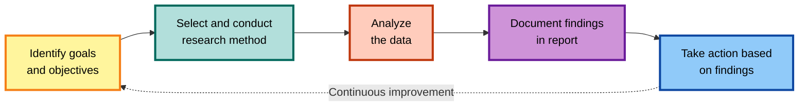

Most technical writers build documentation around assumptions. They assume users need detailed API references, want exhaustive tutorials, or will read every section in order. But assumptions often fail, and user behavior tells a different story.

User research is the clearest way to uncover that behavior. So _what is user research?_ User research is the process of investigating user behaviors, needs, and motivations through observation and feedback. In documentation, this means studying how users navigate your content, what information they seek, and what barriers prevent them from finding answers.

Despite its importance, many technical writers have never conducted formal user research. For some, the challenge is knowing where to begin. Others struggle with limited time, resources, or stakeholder support. And many have yet to realize the significant impact that user research can have on documentation quality.

## When to conduct user research

Just like the main product, user research fits into every stage of the documentation lifecycle: discovery, validation and testing, launch, and post-launch. Each stage offers an opportunity to learn from users and use those insights to improve clarity, structure, and usefulness.

The discovery stage is about understanding user needs before you begin writing. User research at this point can help you identify which product features users engage with most or struggle to use. This information then guides your documentation strategy and content priorities.

The validation and testing stage focuses on verifying that your documentation approach works in practice. Here, you are conducting user research on content drafts or prototype structures to reveal whether users can easily find information and understand explanations.

The launch stage is when your documentation reaches users for the first time. User research at this point helps you confirm whether it meets their immediate needs. You can conduct user research to know if users can locate the right information quickly and whether anything important is missing.

The post-launch stage is about continuous improvement. Once documentation is in regular use, user behavior data and feedback uncover patterns you might not expect.

## The stages of user research

The user research process includes five stages. First, you identify your goals and objectives. Next, you select and conduct the right research method. Then, you analyze the data you have gathered. After that, you document your findings in a report. Finally, you take action based on what you learned.

### Identify your user research goals and objectives

User research without clear goals wastes effort and time. You need to know exactly what you want to learn before speaking with users or collecting data. Clear goals turn user research from a broad exploration into a focused investigation that produces actionable insights.

Start by clarifying what you want to discover. Perhaps you need to understand why users stop reading your documentation after the first page. You might want to know which tutorial users find most valuable or whether they prefer code examples before conceptual explanations. Write down these questions so your research remains purposeful.

Next, identify your knowledge gaps. What information about your users do you lack? Where are you relying on assumptions instead of evidence? These unknowns become your user research targets. If you are unsure which audience segments rely on certain sections of your documentation, that's a gap worth investigating. If you don't know whether users understand your technical terms, that's another area to explore.

Then define what success means for your research. How will you know when you have enough information to make decisions? You might decide to interview eight users from different audience segments, collect at least one hundred survey responses, or observe five usability testing sessions. Set clear completion criteria so you know when to stop researching and start acting on your findings.

You should also connect your user research to organizational goals. Documentation doesn't exist in isolation. If your organization wants to reduce support ticket volume, research how documentation could answer common support questions. If the goal is faster user onboarding, research what information new users need first. Aligning user research with business goals and priorities makes it easier to get stakeholder support and resources for your user research.

Finally, work with stakeholders to identify these goals. Talk to product managers about product priorities. Discuss pain points with customer support teams. Ask sales what questions prospects ask most often. Stakeholders provide context about what matters most to the business and what problems need solving urgently. Their input will turn your user research into a collaborative effort with buy-in from people who will later use your findings to make real improvements.

### Choose and conduct the right user research method

There are many user research methods, but not all methods work well for documentation. The methods most relevant to documentation are interviews, surveys, focus groups, and usability testing.

Your choice of user research method depends on several factors, including the documentation stage, the questions you want to answer, and the type of data you need. Some methods work best during discovery, while others are more useful after launch.

#### Interviews

In interviews you ask users about their experience with your documentation. You might ask how they found specific information, what they were trying to accomplish, and where they struggled. The conversation format lets you probe deeper when users mention something interesting.

Interviews are the most valuable user research method for documentation. They provide rich, detailed insights into user thinking that other methods can't match. A good interview reveals not just what users do, but why they do it and how they feel about it. They reveal workarounds they've developed because the documentation wasn't clear.

When conducting interviews, you need access to actual users. This sounds obvious but poses real challenges. You need users willing to spend a reasonable amount of time talking with you. You also need to sample diverse users so your user research represents your full audience. If your product serves developers, designers, and product managers, interview people from each group. Don't rely on three developers and call your user research complete.

By default, avoid interviewing people with obvious bias toward your product. Don't interview your beta testers who love everything you build or colleagues who know your product inside out. These people can't represent typical user struggles. Then ask for permission to record sessions so you can review them later and capture the non-verbal cues alongside verbal responses. Body language can sometimes reveal frustration or confusion that users might not articulate.

The main drawback of interviews is the recruitment difficulty. Users are busy, and they don't owe you their time. Getting five quality interviews might take weeks of outreach. You might need to offer incentives like gifts or public appreciation posts. Even with incentives, you might still face rejections. Some teams simply can't get enough users to agree to interviews, so they use other user research methods.

#### Surveys

Surveys gather feedback from many users quickly through structured questions. Unlike interviews, surveys can reach hundreds or thousands of users with consistent questions. This scale makes surveys valuable for measuring how widespread specific issues are and for validating patterns you've observed in other user research.

Surveys work well when you have already launched your documentation and users have had real experience using it.

In surveys, start by clearly defining who you want to hear from. Segment users by experience level, role, or behavior so their responses reflect distinct perspectives. For example, new users often face different challenges than experienced users, so each group may need its own survey. You can also target people who recently used specific documentation sections to capture fresh feedback.

Once you’ve identified your audience, focus on specific behaviors and experiences. A question like “How often do you use our documentation?” provides far more useful data than a broad “Do you like our documentation?”

Next, mix question types strategically to capture both measurable and descriptive feedback. Multiple-choice questions provide quantifiable data, while open-ended questions let users share details you might not have anticipated. Aim for a balance: use mostly closed questions for statistical analysis and include a few open ones to uncover unexpected insights.

How you distribute your survey also affects participation. In-product surveys reach users while they're actively engaging with the documentation. Email surveys work well for users who have visited recently, while social media or community forums can connect you with a broader audience. Choose the distribution channel that best fits your target users.

Finally, watch out for survey fatigue. Long surveys discourage responses, so keep them short. Every question should serve a clear purpose. If you can’t explain why a question is included, remove it.

#### Focus groups

Focus groups bring together multiple users for a moderated discussion about documentation. The group setting encourages participants to share experiences and uncover insights that individual interviews might miss.

They work best for mature documentation that needs refinement. Once you have substantial content, focus groups help you discover emotional reactions and usability issues that other methods may overlook. When one person mentions a frustration, others might share a similar experience, which gives you a fuller picture of user sentiment.

Focus groups also reveal needs that users might not express in surveys and interviews. One user's comment may trigger memories or thoughts in others.  A discussion about navigation might evolve into a discussion about terminology confusion.

To get the most value, use a trained moderator to guide the session. Good moderators ask open-ended questions, listen actively, and encourage balanced participation. They should also keep discussions focused without steering users toward specific conclusions.

It's also important to create a comfortable environment where users feel safe sharing honest opinions. Some users won't criticize documentation if they feel defensive. Emphasize that you want to hear about problems, not just praise. Also, ask for permission to record sessions so you can review them later and capture nuances such as tone, expressions, and group reactions.

#### Usability testing

Usability testing observes real users attempting tasks with your documentation. Instead of relying on what users say, it focuses on what they actually do. This method reveals problems that users might miss in interviews or surveys because they don't realize they're struggling or they've forgotten specific pain points. It works best during the validation and testing stage and the post-launch stage.

Testing should involve real target users rather than colleagues or stakeholders. Colleagues are too familiar with the product to notice the same challenges as new users, while stakeholders approach documentation with business goals in mind. You need participants who reflect your actual audience and explore your documentation with genuine questions and needs.

Also, keep test scenarios realistic and goal-oriented. Avoid tasks that users may never complete or attempt. Focus instead on the most most practical and important aspects of your documentation.

### Analyze user research data

Once you’ve conducted user research, the next step is to analyze your findings. Different research methods generate different types of data, each requiring its own approach. Understanding these distinctions helps you extract meaningful insights and make informed decisions.

User research data fall into two main categories: quantitative and qualitative. Surveys provide measurable quantitative data, while interviews and other methods produce qualitative data that reveal patterns and themes.

Analyzing quantitative data like survey responses requires looking at response distributions. For instance, if 80% of users rate your documentation four out of ten or lower, you have a satisfaction problem. If responses split evenly across all ratings, you might have different user segments with different needs. Look at open-ended survey responses for themes that explain the numbers. Maybe users consistently mention that examples are outdated or that navigation is confusing.

Qualitative data, on the other hand, answers questions about “why” and “how”.

Interview analysis begins with reviewing notes or transcripts to identify recurring themes. If several users mention struggling to find configuration examples, that’s a theme worth addressing. Look for both pain points and positive moments. Users often share workarounds that reveal both problems and potential improvements.

Focus group analysis considers group dynamics alongside what participants say. Look for topics that drew quick agreement or sparked debate. Agreement often reflects shared experiences, while disagreement may point to differences between user groups or audiences. Pay attention to which comments prompted strong reactions from others.

Usability testing analysis focuses on what users do rather than what they say. Combine quantitative measures like task success rate and time on task with qualitative observations such as frustration, confusion, or satisfaction. Start by reviewing recordings, notes, and task metrics. Look for moments where users hesitated, got lost, or misunderstood instructions. If multiple users struggled with the same step or overlooked a key link, that signals a usability issue.

### Write the user research report

After analyzing your findings, communicate them clearly to stakeholders who can act on your insights through a report. A user research report documents your process, findings, and recommendations. It explains what you learned and why your proposed changes matter.

User research reports serve multiple audiences, each with different goals. Product managers rely on them to understand how documentation issues affect user success. Engineers use them to identify which technical topics confuse users. Support teams look for ways documentation can reduce ticket volume. Tailor your report to each audience’s specific needs and context.

The report also becomes a valuable reference for future work. Months later, you can revisit insights to guide updates. When new team members join, the report helps them understand user needs and past decisions. Over time, research reports build institutional knowledge that strengthens documentation quality.

Regarding the format, choose a report format that fits your organization's communication style. Written reports are best for detailed findings that stakeholders can reference repeatedly. Slide decks suit executive reviews that favor concise summaries. Wiki pages or shared documents make research accessible across the team.

It's also important to include relevant research artifacts and deliverables in your report. Such artifacts include customer journey maps and user personas. These artifacts make abstract research concrete and actionable during planning.

### Take action on user research findings

Once you’ve gathered insights, analyzed data, and written reports. The next step is to translate those findings into improvements. Acting on what you’ve learned closes the feedback loop and shows users that their input drives real progress.