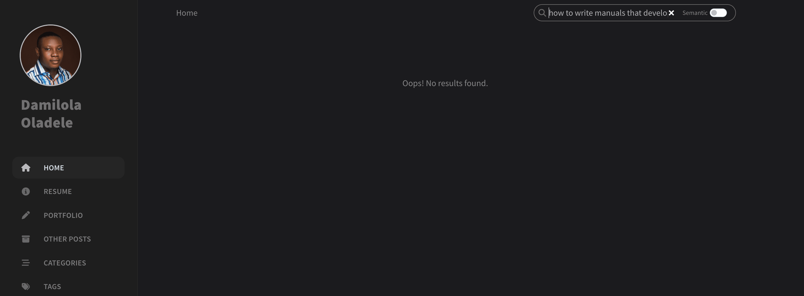
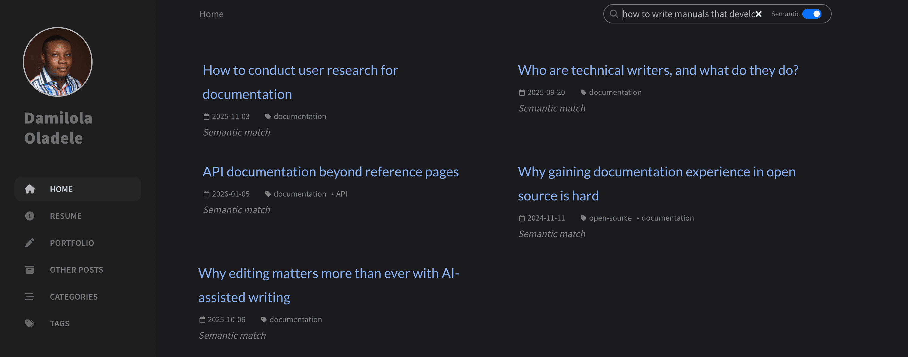
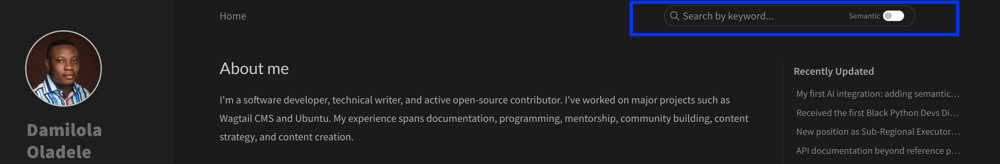
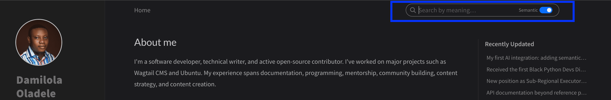

Lately, I've been learning a lot about AI integrations. Reading and watching tutorials only takes you so far, so I've been on the lookout for practical experience. I wanted a real project where I could ship something and learn from the challenges of building. 

That opportunity came recently when I wrote a post on how to implement semantic search. The post is yet to be published, but writing it left me wanting to build the thing myself rather than just describe it.

If you're unfamiliar with semantic search, the difference between it and a traditional keyword search is simple. Traditional keyword search looks for exact word matches. Semantic search tries to understand the meaning behind a query and compares that meaning to the content it searches. As a result, a query can match a post even when they share no words, as long as they are about the same underlying idea.

After some thought, I decided to practice on my own blog, which is a <a href="https://jekyllrb.com/" target="_blank">Jekyll</a> site.

The blog previously used <a href="https://github.com/christian-fei/simple-jekyll-search" target="_blank">Simple Jekyll Search</a> exclusively. It's a lightweight keyword-matching library that searches against a pre-generated `search.json` file. This falls short when a reader searches by meaning rather than exact words. For example, a query like "how to write manuals that developers actually read" would return no results, even though several of my posts relate to that topic. The exact wording doesn't match:

Semantic search fixes this gap:

But adding semantic search to a blog like mine came with two main constraints. The solution had to cost nothing to run, and it couldn't make the existing search experience worse. The rest of this post is about how I worked within both.

## The first constraint: zero running cost

My blog is static. It has no backend, no database, no paid API, and Netlify serves the files from a CDN. So any solution I picked had to stay inside that model.

The common integration approach is to route queries through a server. A small serverless function receives the query, runs it through a model, and returns ranked results. But a server, even a serverless one, brings problems. It adds infrastructure to maintain, introduces latency from cold starts, and may cost money as traffic grows. None of that fits a free, static blog.

So I dropped the server idea and committed to a fully static approach. The next question was where to do the heavy work of turning text into vectors. This step is called embedding. An embedding is a list of numbers that captures the meaning of a piece of text, and you compare two embeddings to measure how similar they are.

I considered two places to do it: in the browser at runtime, or ahead of time when the site builds.

Runtime embedding means the browser downloads the model and runs it against every post before it can search. Every visitor pays that overhead on every visit. My posts rarely change between visits, so recomputing their vectors each time is wasted work. It also multiplies data transfer and computation by the number of visitors.

Build-time embedding avoids all of that. When I push a change, Netlify runs a Python script before Jekyll builds the site. The script does more than turn posts into vectors. It reads every post, but skips any marked as a draft or unpublished, so content I've excluded never reaches search. For each remaining post, it pulls the title, tags, and date from the frontmatter. It then strips the body down to plain text, removing headers, links, and code blocks. Next, it trims the text to a fixed length so each input stays within the model’s limits. Before embedding, it repeats the title inside the text to give title words extra weight during matching. Finally, it converts each post into a vector and writes everything to a static JSON file. Jekyll picks up that file as a static asset, and the Netlify CDN serves it at zero cost.

Now the only thing left to embed is the short query the reader types in the browser.

## The second constraint: no loss in user experience

With the cost problem solved, I turned to the experience problem.

My blog already had Simple Jekyll Search, and it works. It returns results in under 50 milliseconds for a query against a small JSON file. For a reader who knows the exact title or term they want, it's the right tool.

My first instinct was to ditch keyword search altogether and rely on a single search mode based on meaning.

That plan had an obvious flaw. Semantic search needs the browser to load a model before it can answer any query. That model is about 24 MB. On a fast connection, the load takes a few seconds. On a slow one, it takes longer. Forcing every reader to wait for that download, even someone who just wants to jump to a post by title, would make the common case slower. That's a regression with no upside for the reader.

So I decided to add semantic search as an optional mode alongside keyword search. Readers can turn it on using a toggle in the search bar. Keyword search stays the default. Each mode now does what it's best at. Keyword search handles quick, specific lookups. Semantic search handles exploratory queries, where the reader can't name exactly what they want or the relevant posts use different words from the query. Neither mode is a fallback for the other.

While the toggle solved the regression for keyword users, it left a smaller problem behind. There's still a wait when someone switches to semantic mode for the first time. The model download is the only real source of delay. Once it's loaded, a query takes well under a second. So the question became: when should that download start?

My first solution was to preload the model when the page went idle. The browser would start downloading the model in the background after the page finished loading. The assumption was that the model would be ready by the time a reader opened search and turned on semantic search using the toggle. Unfortunately, this introduced a regression. On slower connections, the model download competed with the page load no matter when it started. So browsing the blog felt sluggish, even for readers who might not use the search feature. That defeated the purpose of having a fast static site, so I removed it.

The solution I settled on preloads the model only when the reader signals intent by clicking the search icon or focusing on the search input field. Someone who opens search is likely to use it. The download starts quietly in the background at that moment. By the time the reader notices the toggle and flips it, the model is often ready or close to it. Readers who never open search never trigger the download at all, so the page load stays untouched.

A small guard prevents duplicate downloads. If the reader flips the toggle while the download is still running, the code sees it's already in progress and does nothing new.

The choice of embedding model mattered here too. A larger model gives better results, but it would be too heavy for a browser. I chose the <a href="https://huggingface.co/BAAI/bge-small-en-v1.5" target="_blank">bge-small-en-v1.5</a> embedding model, which is about 24 MB in its quantized form and performs well for its size. My blog is English-only, so I gained nothing from a larger multilingual model. The model is also free and open source.

One rule is non-negotiable: the same model has to run at build time and in the browser, because vectors from different models live in different number spaces and can't be compared.

One tradeoff remains. A reader on a very slow connection who opens search and immediately flips the toggle may still see a brief loading message. I accept that, because the wait happens only once. After the model loads, it stays in memory for the rest of that page, so repeated searches return fast without reloading it. The browser also caches the download itself, so the model doesn't download again on later visits unless the reader clears their browser data. The alternative, downloading on every page load, would charge every visitor for a feature some of them might never use.  my blog</a> by opening the search bar and turning on semantic search using the toggle. For now, I'm looking forward to finding other AI integrations I can experiment with.
