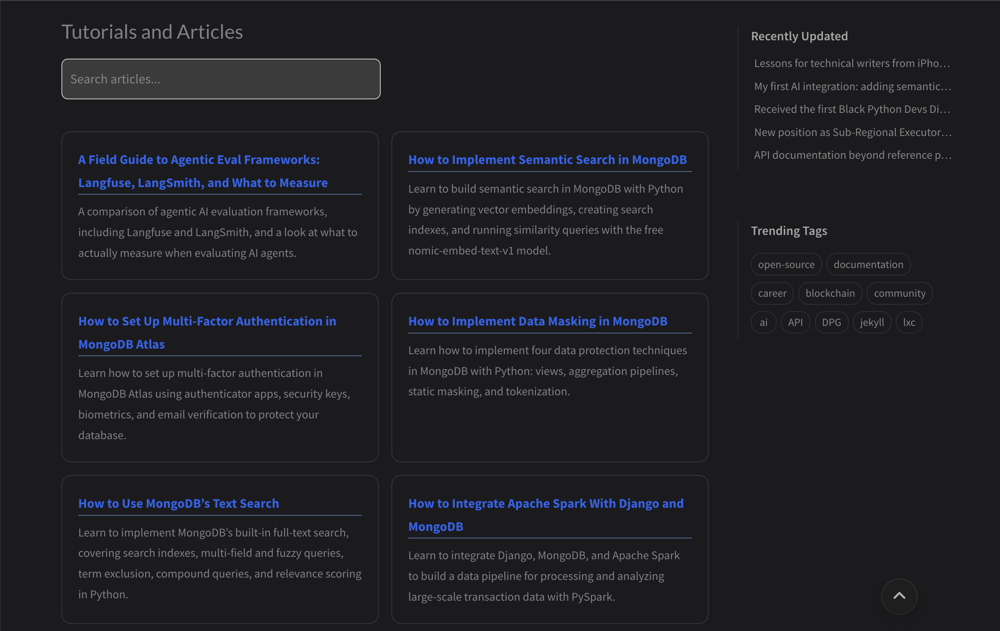

In an earlier post, I explained <a href="/posts/my-first-ai-integration/" target="_blank">how I added opt-in semantic search to this blog</a>. That version only understood posts written in Markdown and stored in the blog's source code. It had no way to reach content I'd published somewhere else. Several of those links already appear on my <a href="/portfolio/">Portfolio</a> and the <a href="/other-posts/">Other Posts</a> pages.

Let's say a reader searches for “how to secure data in a document database.” A tutorial I wrote for GeeksforGeeks on data masking in MongoDB answers that question, but semantic search had no way to know it existed.

The following is a screenshot of the same search after implementing the external search feature:

The problem was that semantic search can only find content that has been added to its search index. The search index contains embeddings generated from text. When a reader searches, the blog compares the query against those embeddings to find content with a similar meaning. For blog posts hosted in the blog's source code, the build script already had everything it needed to create those embeddings: a title, tags, and a body of text pulled straight from each post's frontmatter and Markdown content.

The Portfolio and Other Posts pages work differently. Each link there is a hand-written HTML card containing a title, a URL, and nothing else. There's no frontmatter, body text, or structured data for the build script to use. So the indexing logic that worked for blog posts had nothing to work with on these pages.

Also, every blog post already has a body of text to embed. These HTML cards didn't, so I needed some text that could serve as their representation in the search index. The simplest option would have been to embed the title alone, but a title is only a handful of words. That produces a sparse representation with little for a query to match against. Instead, I gave each card a short description summarizing what the linked content actually covers. The description gives semantic search more context to work with, making related searches more likely to surface the right link. Readers also see the same description directly on the card, right under the title.

Generating the descriptions only took a few minutes. I used Claude Code to read each linked article with its `WebFetch` tool and draft a description from what it found.

With descriptions in place, the build script still needed a way to read them. There was still no frontmatter to parse, so it reads the Portfolio and Other Posts pages as HTML directly. It looks specifically inside the Tutorials and Articles section and the Other Posts section, pulls out each card’s title, link, and description, and ignores everything else on those pages.

That parsing step surfaced a problem I hadn't planned for. Some of these cards link back to posts hosted on my blog. For example, a guide to getting started with LXC and several blockchain posts appear in the Tutorials and Articles section. These are full posts already indexed with their own body text. Embedding both versions would mean a single query could return the same post twice: once from its own embedding and again from the card pointing to it.

I fixed this by checking every external link's URL against the posts already indexed before adding it. If there's a match, the link gets skipped, and the post's own embedding is built from its full body rather than its description.

One detail almost slipped through. Every external link on the Portfolio and Other Posts pages opens in a new tab, so readers never lose their place on the blog. Search results didn't follow that rule. Clicking a search result for an external post would have carried readers away in the same tab.

I fixed this by checking each result's URL before rendering it. Anything starting with http now opens in a new tab. This matches the behavior readers already expect from the blog.

You can try it on <a href="https://damilola-oladele.dev" target="_blank" rel="noopener noreferrer">my blog</a> by opening the search bar, turning on semantic search, and searching for a topic you'd expect me to have written about somewhere.
